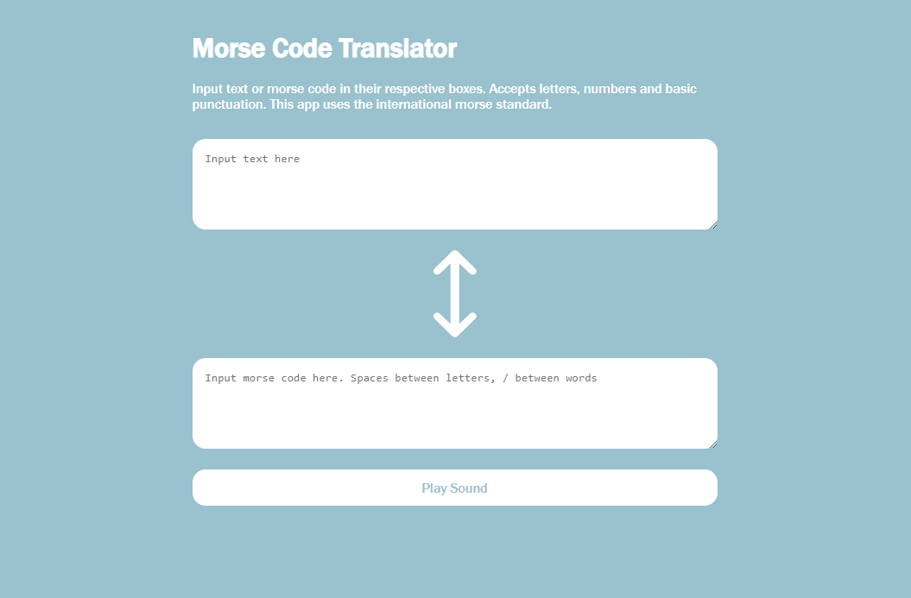

# Morse Code Translator Project

[Find this project hosted here](https://kchn.com.au/morse-code-translator)



This is a simple web application in native JavaScript that allows the user to
either input English text or some Morse code and have it translated. It also
uses the Web Audio API to programmatically play the morse code audio.

## Project Brief

### Aims

I am doing this project in order to reinforce my learning in JavaScript, unit
testing, DOM manipulation and design patterns.

### Minimum Viable Product

-   Create a user interface that allows the user to either input some English
    text or some Morse Code
-   Create JS functions that would allow the user to translate their English
    text into Morse Code or Morse Code into English text
-   Morse code should have the following format:
    -   Spaces between letters
    -   Slashes between words

## Technical implementation

### Translator Class

I wanted to only have two inputs fields, where any interaction with one input
would result in the text being translated into the opposing one. The simplest
way I could think of implementing this was with an object that is capable of
controlling both input elements at the same time.

I ended up creating a class that contained two maps. One each to serve as
dictionaries to translate from English to Morse and Morse to English. It also
had two strings as properties, one for each textarea. It also had a translate
function that required you to specify which way you intended to translate, and
the text to be translated. The output of the function would be the class's own
properties.

To use this class, you would create an instance and tether the
`translator.english` and `translator.morse` properties to their corresponding
textarea elements. This created a pattern similar to controlled components in
React.

### Web Audio API

The web audio API allows the programmer to input audio using sound files or
oscillators and filter them through a modular chain of nodes. I chose this API
because it had a built-in oscillator node that was perfect for my application.
All I needed to play a morse code was to generate a sine wave. The documentation
for this API wasn't as thorough as I wanted so it was hard to get started.

The final implementation used a ControlSineWave class that, when an instance is
constructed, initialises an audio context and the required nodes to output the
desired sound. It has an interface that allows another function to mute and
unmute the sound.

To get the right timing for the mutes and unmutes was difficult. I ended up
chaining promises onto each other to create a kind of schedule of instructions
for JavaScript to mute and unmute.

```
// create an already resolved promise to chain .then() onto
// skips having to create a promise the long way only to chain
// then() onto
let chain = Promise.resolve();

morseArray.forEach((letter) => {
    let time = 0;
    switch (letter) {
        case '-':
            time = 500;
            break;
        case '.':
            time = 80;
            break;
        case ' ':
            time = 300;
            break;
        case '/':
            time = 300;
            break;
    }
    chain = chain.then(() => playLetter(letter, time));
    console.log(chain);
});
chain.finally(() => {
    controlSineWave.end();
});
```

This works by replacing the `chain` variable with its own `.then()` promise.
`chain` might be better named as `previousPromise`. This is counter-intuitive to
me because it's hard to imagine there are promises still pending in memory when
they aren't stored in an array or something visible to the programmer.

## Project Reflection

Overall the project meets the requirements. I was definitely more confident with
Jest this time around and saved a lot of time when doing testing. This was an
enjoyable project to make since the brief was relatively straightforward.
